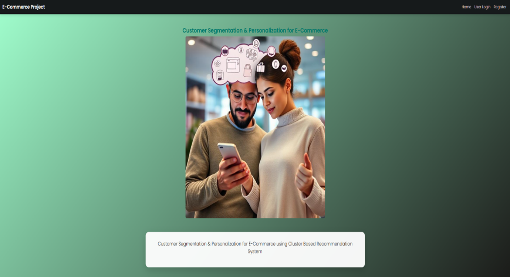
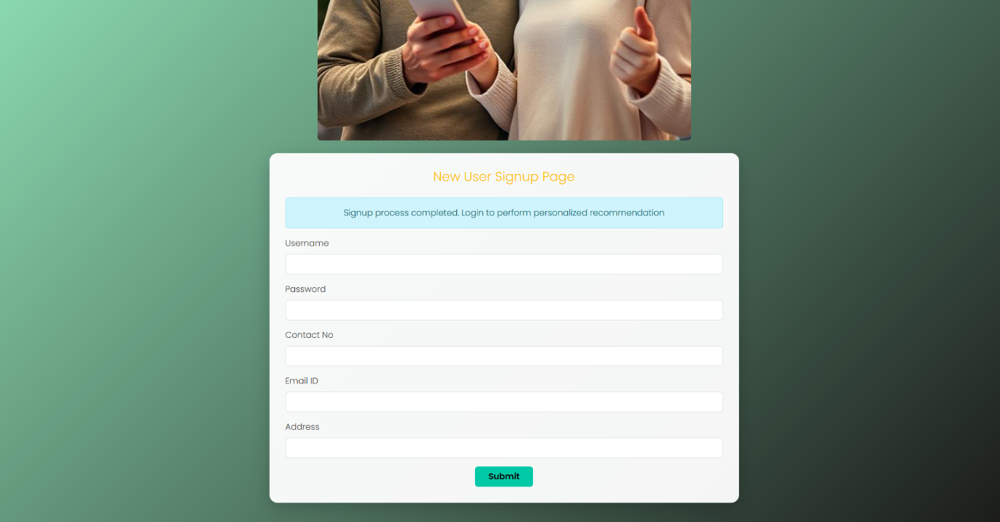
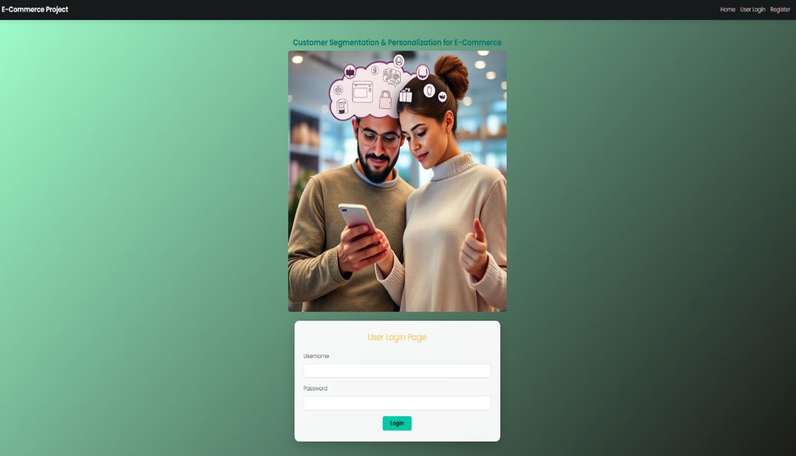
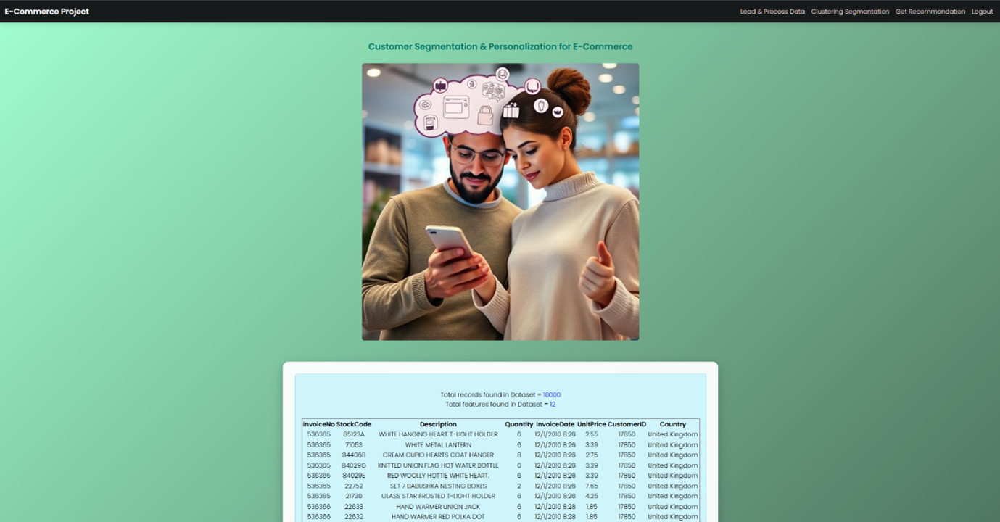
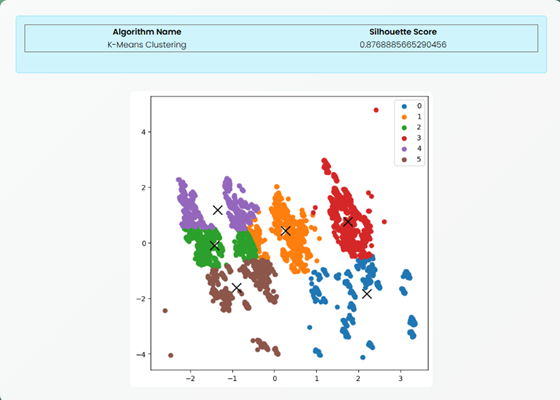
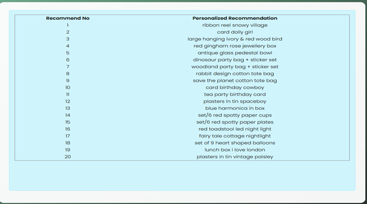
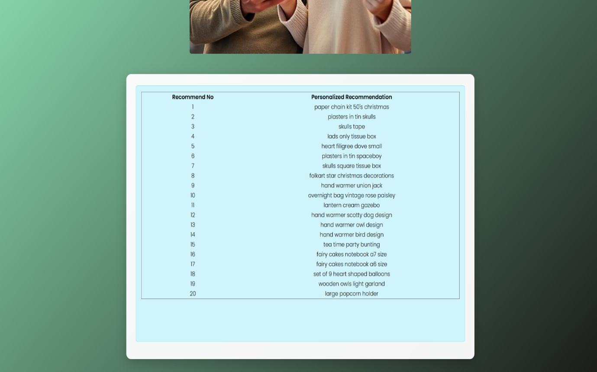

# 🛍️ E-commerce Customer Segmentation & Personalized Recommendation System


---

## 📄 Abstract

In modern e-commerce, recommending the right product to the right customer is crucial. Traditional systems often fail to consider customer heterogeneity, leading to poor engagement and reduced sales.  

This project introduces a **hybrid recommendation system** that first segments customers using **K-Means clustering** (based on RFM features) and then provides **personalized, content-based recommendations** within each segment.  

---


## 🚀 Features

- ⚡ Customer segmentation using K-Means clustering
- 📊 Dimensionality reduction with PCA for visualization
- 💡 Personalized product recommendations per segment
- 🌐 Web-based interface with user registration & login
- 💬 Real-time recommendation retrieval
- 🧩 Modular architecture for easy scaling
- ✅ High cluster quality with Silhouette Score ~0.82

---

## 🏗️ System Architecture

```
+------------------------+
|   Frontend (HTML/CSS)  |
+-----------+------------+
            |
            v
+------------------------+
|  Django Backend (Python)|
+-----------+------------+
            |
            v
+------------------------+
|   Machine Learning     |
| (K-Means, PCA, Recomm.)|
+-----------+------------+
            |
            v
+------------------------+
|      MySQL Database    |
+------------------------+
```

---

## ⚙️ Tech Stack

- **Languages & Frameworks:** Python, Django, HTML, CSS, JavaScript
- **ML Libraries:** Scikit-learn, Pandas, NumPy
- **Database:** MySQL
- **Visualization:** Matplotlib

---

## 📂 Project Modules

### 👥 Registration & Login

- User authentication
- Session management

### 🗂️ Dataset Loader

- Upload and preprocess customer datasets

### 🔬 Clustering Engine

- Segment customers based on RFM features
- Evaluate clusters using Silhouette Score

### 💬 Recommendation Engine

- Generate content-based recommendations within clusters

### 📊 Visualization

- Cluster visualization plots
- Interactive segment analysis

---

## 🏆 Results

| Metric                    | Value            |
|---------------------------|------------------|
| Silhouette Score          | ~0.82           |
| Average Segmentation Time | ~2.1 seconds   |
| Recommendation Time       | ~0.5 seconds   |
| Optimal Clusters          | 6               |

---

## 💻 How to Run

```bash
# Clone the repository
git clone https://github.com/puneeth2805/E_commerce_recommendation_system.git
cd E_commerce_recommendation_system

# Install requirements
pip install -r requirements.txt

# Setup database
# Import `database.txt` schema into your MySQL instance

# Run the server
python manage.py runserver

# Open in browser
http://127.0.0.1:8000/
```

---

## 📸 Screenshots

### 🔥 Home Page


### 📝 Registration


### 🔑 Login


### 📂 Dataset Upload


### 📊 Cluster Visualization


### 💬 Segmentation Output


### 💬 Personalized Recommendations



---

## 🌟 Future Enhancements

- 🔄 Hybrid filtering (combining collaborative & content-based)
- 🧠 Incorporate deep learning models (autoencoders, transformers)
- 💬 Integrate real-time user feedback and self-learning
- ☁️ Deploy on AWS/GCP using Docker containers
- 📈 Advanced analytics dashboards (e.g., Power BI integration)
- 🔒 Enhanced security: encrypted passwords, OAuth

---

## 🛡️ License

This project is licensed under the MIT License — see the [LICENSE](LICENSE) file for details.

---


⭐ **If you like this project, please give it a star on GitHub! It helps us grow and reach more learners and developers.**

---
